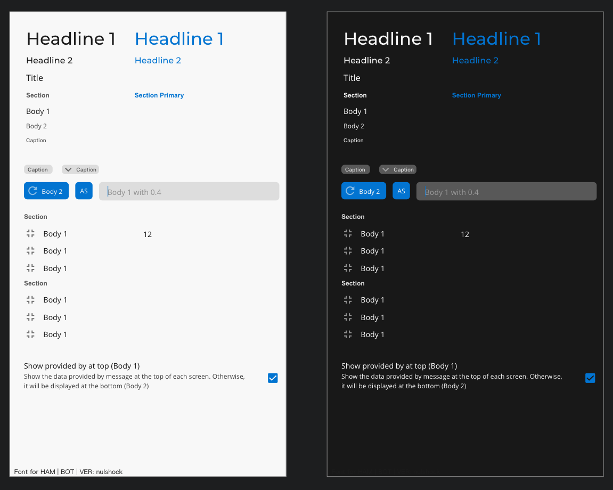

# Flashback - Android 

Flashback is a Formula 1 statistics app!

### Style guide

### Architecture

### Configuring notifications

- [Dashboard](https://console.firebase.google.com/project/f1stats-live/notification)
- In app messaging says it's "30 minutes before the race"
- Channels:
    - `race`
    - `qualifying`
    - `seasonInfo`

### Libraries

- MVVM
- Koin
- Firebase
- Kotlin Coroutines
- LiveData
