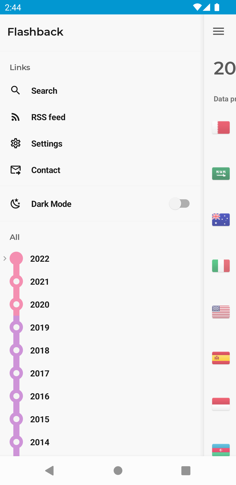

  

<h1 align="center">Flashback</h1>

  
  
  
  

### Screenshots

|   |   |   |   |
|---|---|---|---|
|  |  |  |  |
|  |  |  |  |

### Architecture

This is a multi module app split like the diagram below. Modules listed in the core section are used as and when needed by any module.

