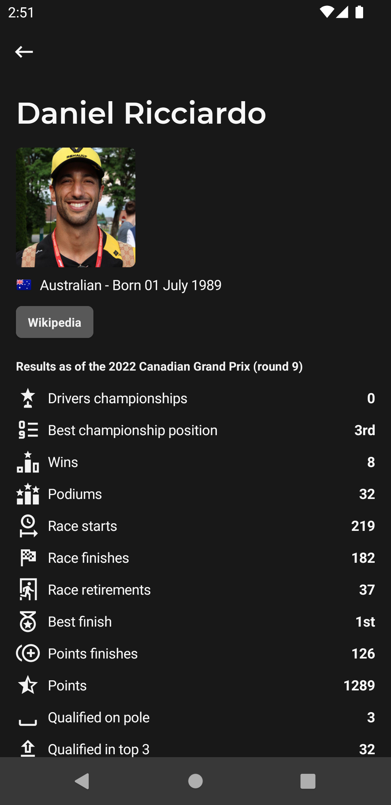

  

<h1 align="center">Flashback</h1>

  
  
  
  
  

Flashback provides race results and statistics from every race in the history of Formula 1 and the latest Formula 1 news from around the web!

### Screenshots

|   |   |   |   |
|---|---|---|---|
|  |  |  |  |
|  |  |  |  |

---

### Play store listing

Flashback provides race results and statistics from every race in the history of Formula 1 and the latest Formula 1 news from around the web!

Flashback features include:

- Race results up to the latest race
- Qualifying results, deltas and grid penalties
- Driver information
- Constructor championship points for a race
- Driver championship standings for a season
- Constructor championship standings for a season
- Track list for a season
- Configurable RSS feed for Formula 1 updates
- Driver career overview and points breakdown
- Constructor history and overview
- Races held at a given track
- In app section for upcoming events in Formula 1
- Notifications support for races and qualifying sessions

We also have an RSS hub where you can configure RSS feeds for Formula 1 news!

We plan to keep adding new features and statistics, if you have any suggestions that you would like to see please submit a suggestion from the settings in the app!

With the 2021 season underway, the calendar might be subject to change as races are cancelled or rescheduled. As such 2021 data may fail to appear in the app after a race has completed or the upcoming calendar in app may not be accurate. We will endeavour to get this resolved as soon as possible!

Data is supplied by the Ergast API and cached by the flashback team, thanks to them for making this app possible! You can contact the Ergast API team at ergast.com/mrd/

Flashback includes quick links for Formula 1 RSS feeds from autosport.com, crash.net, motorsport.com, pitpass.com, f1-fansite.com, bbc.co.uk, theguardian.com, wtf1.com, grandprix247.com, f1i.com, and f1technical.net, but is not affiliated with them in any way

Flashback is also not affiliated in any way with any of the Formula One group of companies: FORMULA 1, FIA FORMULA ONE and related trademarks of Formula One Licensing BV

Contact Email: thementalgoose@gmail.com

---

### Architecture

This is a multi module app split like the diagram below. Modules listed in the core section are used as and when needed by any module.

